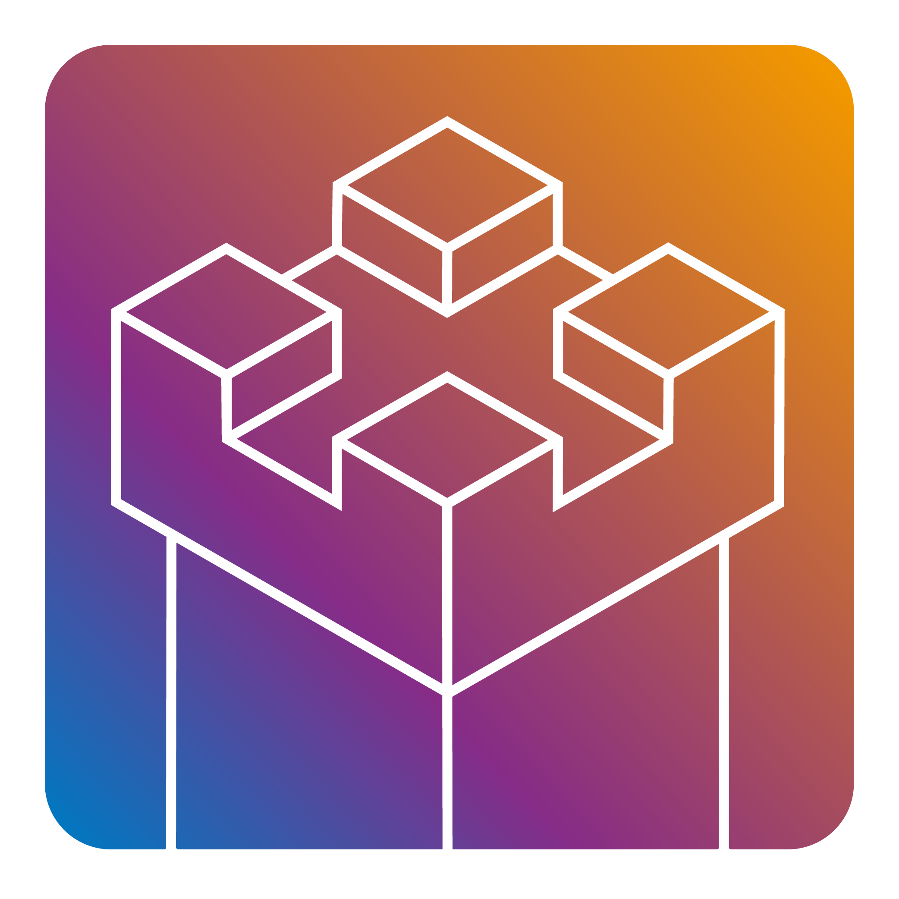

---
# Exforthia 

***A secure, offline desktop password and OTP manager***  

Exforthia is a desktop application designed to securely manage passwords and **[OTP codes](https://en.wikipedia.org/wiki/One-time_password)** without relying on mobile devices or cloud services. Unlike most authentication solutions that are tied to smartphones, Exforthia provides a **local-first** alternative, ensuring that your sensitive data remains secure and accessible even without an internet connection or a movile phone disponible.  

---

### **Under Development 🚧**  
Please note that Exforthia is currently in its early development phase, being structured under the **[MVC](https://en.wikipedia.org/wiki/Model-view-controller)** architecture with an **[Object-Oriented](https://en.wikipedia.org/wiki/Object-oriented_programming)** foundation.  

🚀 Stay tuned for updates and feel free to contribute to the project once it's open for collaboration!  

---

### **Future Key Features**  

<h6>What are the plans for the future of this app?</h6>

- 🔹 **Desktop-First Approach**  
    Exforthia is envisioned as a Windows desktop application, providing a secure and persistent alternative to mobile-based 2FA solutions.

- 🔹 **Offline and Local Storage**  
    Planned to store all data locally and encrypted, ensuring protection against cloud-based breaches or online leaks.

- 🔹 **Strong Encryption & Obfuscation**  
    Future implementations will include proprietary encryption methods to keep data unreadable without the application.

- 🔹 **Windows Hello Integration (Planned)**  
    Anticipated support for Windows Hello authentication to enhance accessibility while maintaining security.

- 🔹 **Intuitive & User-Friendly UI**  
    Aiming to deliver a visually appealing and easy-to-use interface for general users, simplifying password management.

- 🔹 **Chromium Browser Extension (Planned)**  
    A future feature to enable seamless migration of saved passwords from Chromium-based browsers.

- 🔹 **Recovery System**  
    A planned recovery mechanism allowing users to regain access via a master recovery file with an obfuscated authentication fragment.

---

### **Why Exforthia?**  
🔐 **A Secure Alternative to Mobile 2FA** – Mobile devices are often lost, stolen, or compromised. Exforthia is designed to offer a desktop-based solution to mitigate these risks.  
🌍 **Open-Source or Closed-Source?** – The project roadmap includes evaluating whether Exforthia will eventually be open-source or remain a closed project.  
📂 **File-Based Syncing** – While cloud-based services may be explored in the future, the initial focus is on encrypted file-based synchronization between devices.  

Stay tuned for updates as these features are developed and brought to life! 🚀    

---

Let me know if you’d like any modifications! 🚀